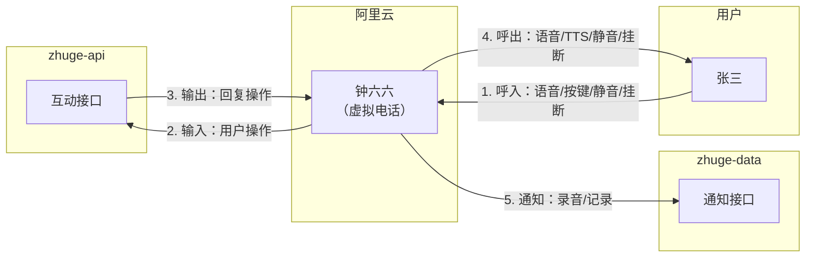

# 面试砖家 - 钟六六

## 介绍
钟辉的第66号弟子，擅长面试，请多指教。

## 使用说明

1.  拨打电话号码：   
2.  随便说点什么

## 参与贡献

### 功能需求

有什么好的想法？只要对你有帮助，六六都尽力帮你实现。

欢迎 [点这里](/../../issues/new?assignees=zhonghuipro&labels=用户故事&template=user-story.md&title=) 写下你的牛逼想法。

### 问题汇报

发现我有点傻？没关系。只要你喜欢，六六尽力改善提升。

欢迎 [点这里](/../../issues/new?assignees=zhonghuipro&labels=bug&template=bug-report.md&title=) 写下你的优化建议。

### 参与建设
想一起改变世界？
1. Fork 本仓库
2. 新建 feature_xxx 分支
3. 提交代码
4. 新建 Pull Request
5. 等待美好的事情即将发生

## 系统架构

## 安装教程

1. [阿里云智能联络中心购买号码](https://help.aliyun.com/product/126730.html) 
2. 部署 [zhuge-api][zhuge-api] 服务
3. 部署 [zhuge-data][zhuge-data] 服务
4. 阿里云智能联络中心控制台 [通用配置](https://aiccs.console.aliyun.com/setting/tabMns)
    1. 添加指定号码呼入设置
    2. 订阅回执消息添加 [zhuge-data][zhuge-data] 通知接口
    3. 回调地址添加 [zhuge-api][zhuge-api] 交互接口

[zhuge-api]: https://github.com/zhonghuipro/zhuge-api
[zhuge-data]: https://github.com/zhonghuipro/zhuge-data
