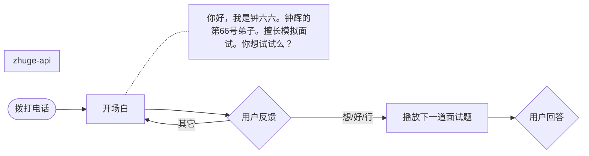

# 功能说明

## 刷题功能
功能流程
1. 拨打电话
2. 

```mermaid
graph LR
A([拨打电话])
B["开场白"]
C["你好，我是钟六六。钟辉的第66号弟子。擅长模拟面试。你想试试么？"]
D{用户反馈}
E["播放下一道面试题"]
F{用户回答}


    A -->B
    B -.- C
    B --> D
    D --"想/好/行"--> E
    D --"其它"--> B
    E --> F

    subgraph ZA[zhuge-api]


    end
```
