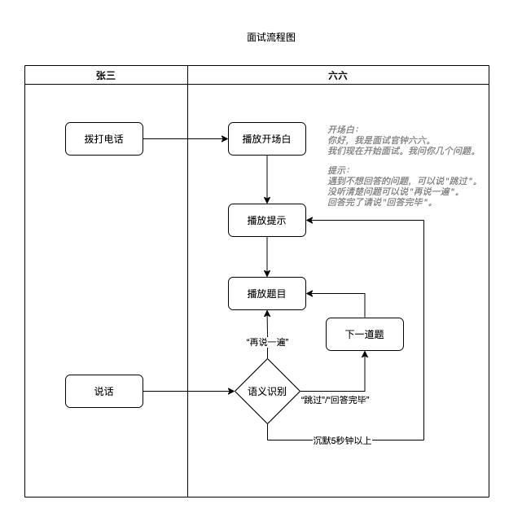

# 功能说明

## 刷题功能

### 功能目标

让用户能回答面试题

### 流程图



### 面试流程

1. 拨打电话
2. 播放开场白
    ```
   你好，我是面试官钟六六。我们现在开始面试。我问你几个问题。
    ```
3. 播放回答提示
    ```
   遇到不想回答的问题，可以说"跳过"。
   没听清楚问题可以说"再说一遍"。
   回答完了请说"回答完毕"。
    ```
4. 播放题目
5. 监听面试反馈
    1. "跳过"/"回答完毕"：
        1. 换下一道题。
        2. 跳到步骤4
    2. "再说一遍"：
        1. 跳到步骤4
    3. 沉默5秒钟：
       1. 跳到步骤3

## BI功能

### 功能目标
1. 能方便查看系统运转状态
2. 能详细分析每次通话过程

### 核心指标表

| 指标    | 指标说明       |
|-------|------------|
| 统计日期  | 20xx-xx-xx |
| 使用人次  | 当日接入人数     |
| 使用人数  | 当日使用人数     |
| 次均分钟数 | 平均接听时长数    |
| 新增用户数 | 当日新使用人数    |
| 累计用户数 | 累计使用人数     |

### 通话详情表

| 指标   | 指标说明                |
|------|---------------------|
| 通话ID | 唯一ID                |
| 用户ID | 加密手机/电话号            |
| 开始时间 | 20xx-xx-xx HH:mm:ss |
| 结束时间 | 20xx-xx-xx HH:mm:ss |
| 对话过程 | A：xxx，B：xxxx        |
| 对话录音 | 录音的URL              |